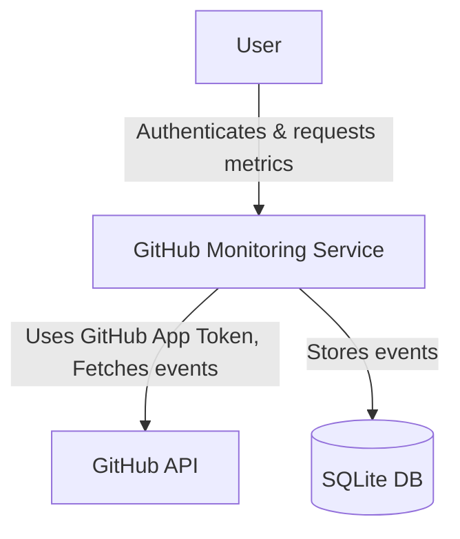

# GitHub Monitor

This project is a Python application that continuously streams public events from the [GitHub Events API](https://api.github.com/events), filters for specific event types, stores them in a local SQLite database, and exposes metrics through a REST API.

---

# How to set up

## Prerequisites

- Docker (recommended)
- Python 3.11+

1. Clone the repo
2. Create a .env file in a root directory based on .env.example

  - GITHUB_TOKEN= Is a token issued from github scoped for public repo
  - SECRET_KEY= your-very-strong-random-string-here

3. Run the App
    - With a Docker (docker run -it --rm -p 8000:8000 --env-file .env github-monitor)
    - Or Locally (uvicorn app.main:app --reload)

4. Authentificate

  - In order to use the app API user needs to send a POST request to (http://localhost:8000/token) with a Username and Password specified in x-www-form-urlencoded Body.

  - User will get a token in response which needs to be used as Bearer Token for next authentification.

5. Use the App

  - After succesfull OAuth2, user can use the endpoints available:
  - /offset_metrics?offset=30   (offset can be changed)
  - /event_type_chart           (to get a chart visualisation)
  - /avg_pull_metrics           (to get avg of pull requests)

## Main Features

- Fetches GitHub events at an interval respecting rate limits.
- Filters only required event types.
- Stores event ID, type, repository name, and timestamp.
- Exposes REST API endpoints:
  - Average time between pull requests per repository.
  - Number of events grouped by type for a specified time offset (e.g., last 10 minutes).
  - Health check endpoint.
  - Simple visualization endpoint (optional bonus).

---

## Technology Stack

- Python 3.11
- FastAPI
- httpx
- SQLite
- Pydantic for configuration
- Docker for containerization

---

## Project C4 (level1) diagram

